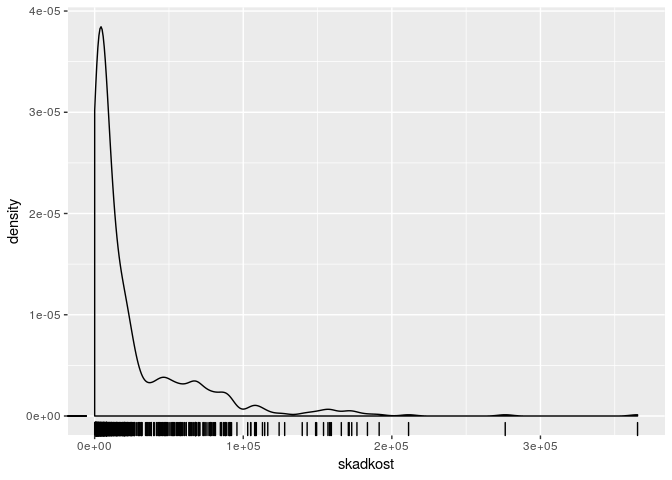

Motorcycle claims - Wasa insurance 1994 to 1998
================
Christian Duffau-Rasmussen
2018-09-30

``` r
library(ggplot2)
library(insuranceData)
library(statmod)
data(dataOhlsson)
```

## The data set

The data comes from the former Swedish insurance company Wasa, and
concerns partial casco insurance, for motorcycles. It contains
aggregated data on all insurance policies and claims during
    1994-1998.

``` r
head(dataOhlsson)
```

    ##   agarald kon zon mcklass fordald bonuskl duration antskad skadkost
    ## 1       0   M   1       4      12       1 0.175342       0        0
    ## 2       4   M   3       6       9       1 0.000000       0        0
    ## 3       5   K   3       3      18       1 0.454795       0        0
    ## 4       5   K   4       1      25       1 0.172603       0        0
    ## 5       6   K   2       1      26       1 0.180822       0        0
    ## 6       9   K   3       3       8       1 0.542466       0        0

The variables are:

  - `agarald` The owners age, between 0 and 99, a numeric vector
  - `kon` The owners age, between 0 and 99, a factor with levels K M
  - `zon` Geographic zone numbered from 1 to 7, in a standard
    classification of all Swedish parishes, a numeric vector
  - `mcklass` MC class, a classification by the so called EV ratio,
    defined as (Engine power in kW x 100) / (Vehicle weight in kg + 75),
    rounded to the nearest lower integer. The 75 kg represent the
    average driver weight. The EV ratios are divided into seven classes,
    a numeric vector
  - `fordald` Vehicle age, between 0 and 99, a numeric vector
  - `bonuskl` Bonus class, taking values from 1 to 7. A new driver
    starts with bonus class 1; for each claim-free year the bonus class
    is increased by 1. After the first claim the bonus is decreased by
    2; the driver can not return to class 7 with less than 6 consecutive
    claim free years, a numeric vector
  - `duration` the number of policy years, a numeric vector
  - `antskad` the number of claims, a numeric vector
  - `skadkost` the claim cost, a numeric vector

<!-- end list -->

``` r
dataOhlsson <- dataOhlsson[dataOhlsson$skadkost>0, ]
```

Subsetting the dataset to only include policies with positive claims,
reduces the dataset from 64548 rows to only 670 rows.

## Density estimates

To estimate the density of the realized claims we use `ggplots` kernel
density estimate. It uses the fnuction `density()` from the base
packages `{stats}`. The default kernel is Gaussian and the bandwidth is
chosen to minimize the MSE of the “true” density and the estimated one.
The procedure is described in (Sheather and Jones 1991).

``` r
ggplot(dataOhlsson, aes(skadkost)) +
  geom_density(alpha=0.2) + geom_rug(aes(x = skadkost, y = 0))
```

<!-- -->

``` r
ggplot(dataOhlsson, aes(skadkost, color=kon, fill=kon)) +
  geom_density(alpha=0.2)
```

<!-- --> Comparing
the distribution of the realized claims, woman have more small claims
than men and the male claims has heavier
tails.

``` r
ggplot(dataOhlsson, aes(skadkost, color=as.factor(mcklass), fill=as.factor(mcklass))) +
  geom_density(alpha=0.1)
```

<!-- --> Inspecting
the density estimates we see that the more powerfull bikes, that is the
higher indexed motocycles, are more likely to produce more expensive
damages.

## Linear model of claim size

Before estimating/training a model we split the data in test and
training set to be able to compute validation metics later on.

``` r
set.seed(123)
test.pct <- 0.15
mask <- runif(n.rows.with.claims)>test.pct
train.data <- dataOhlsson[mask, ]
test.data <- dataOhlsson[!mask, ]
```

We reserve 15% of the data set for testing, so the training set
conatians 575 observations and the remaining 95 observations are used
for
testing.

``` r
model <- lm(skadkost ~ agarald + fordald + kon + factor(zon) + factor(mcklass) + factor(bonuskl) + duration, data=train.data)
summary(model)
```

    ## 
    ## Call:
    ## lm(formula = skadkost ~ agarald + fordald + kon + factor(zon) + 
    ##     factor(mcklass) + factor(bonuskl) + duration, data = train.data)
    ## 
    ## Residuals:
    ##    Min     1Q Median     3Q    Max 
    ## -53133 -22666 -10405   9890 317575 
    ## 
    ## Coefficients:
    ##                   Estimate Std. Error t value Pr(>|t|)    
    ## (Intercept)       38498.06   10451.96   3.683 0.000253 ***
    ## agarald             -57.21     140.90  -0.406 0.684894    
    ## fordald           -1638.12     250.65  -6.536 1.44e-10 ***
    ## konM               6448.48    5731.15   1.125 0.261009    
    ## factor(zon)2       -798.24    4655.98  -0.171 0.863937    
    ## factor(zon)3      -8246.52    5088.42  -1.621 0.105665    
    ## factor(zon)4      -7865.65    4799.88  -1.639 0.101842    
    ## factor(zon)5     -13672.98   13389.69  -1.021 0.307627    
    ## factor(zon)6     -10657.43   10328.26  -1.032 0.302584    
    ## factor(zon)7     -43009.88   38662.81  -1.112 0.266435    
    ## factor(mcklass)2  -8281.97    8643.23  -0.958 0.338380    
    ## factor(mcklass)3   4142.32    7432.34   0.557 0.577523    
    ## factor(mcklass)4  -3612.10    7855.78  -0.460 0.645840    
    ## factor(mcklass)5  -4752.37    7370.67  -0.645 0.519346    
    ## factor(mcklass)6   -577.90    7335.39  -0.079 0.937235    
    ## factor(mcklass)7  -3277.03   18678.89  -0.175 0.860798    
    ## factor(bonuskl)2    494.58    6231.41   0.079 0.936768    
    ## factor(bonuskl)3   9951.02    6670.03   1.492 0.136297    
    ## factor(bonuskl)4   5962.92    6667.62   0.894 0.371546    
    ## factor(bonuskl)5   7388.78    7531.85   0.981 0.327020    
    ## factor(bonuskl)6   9338.50    7647.42   1.221 0.222558    
    ## factor(bonuskl)7    354.22    5003.19   0.071 0.943584    
    ## duration            181.76     634.36   0.287 0.774587    
    ## ---
    ## Signif. codes:  0 '***' 0.001 '**' 0.01 '*' 0.05 '.' 0.1 ' ' 1
    ## 
    ## Residual standard error: 38320 on 552 degrees of freedom
    ## Multiple R-squared:  0.1208, Adjusted R-squared:  0.08575 
    ## F-statistic: 3.447 on 22 and 552 DF,  p-value: 2.832e-07

## Poisson model of number of claims

``` r
model <- glm(antskad ~ agarald + fordald + kon + factor(zon) + factor(mcklass) + factor(bonuskl) + duration, data=train.data, family=tweedie(var.power = 1.5))
summary(model)
```

    ## 
    ## Call:
    ## glm(formula = antskad ~ agarald + fordald + kon + factor(zon) + 
    ##     factor(mcklass) + factor(bonuskl) + duration, family = tweedie(var.power = 1.5), 
    ##     data = train.data)
    ## 
    ## Deviance Residuals: 
    ##      Min        1Q    Median        3Q       Max  
    ## -0.19116  -0.06111  -0.03411  -0.00872   0.82102  
    ## 
    ## Coefficients:
    ##                    Estimate Std. Error t value Pr(>|t|)    
    ## (Intercept)       0.9514558  0.0244264  38.952   <2e-16 ***
    ## agarald           0.0001143  0.0003299   0.347   0.7290    
    ## fordald           0.0016255  0.0005994   2.712   0.0069 ** 
    ## konM             -0.0079347  0.0135032  -0.588   0.5570    
    ## factor(zon)2      0.0137925  0.0108062   1.276   0.2024    
    ## factor(zon)3      0.0053259  0.0117274   0.454   0.6499    
    ## factor(zon)4      0.0168566  0.0111652   1.510   0.1317    
    ## factor(zon)5      0.0282800  0.0320059   0.884   0.3773    
    ## factor(zon)6      0.0040770  0.0237074   0.172   0.8635    
    ## factor(zon)7      0.0329961  0.0926523   0.356   0.7219    
    ## factor(mcklass)2  0.0186224  0.0204864   0.909   0.3637    
    ## factor(mcklass)3  0.0040143  0.0173927   0.231   0.8176    
    ## factor(mcklass)4 -0.0108980  0.0182946  -0.596   0.5516    
    ## factor(mcklass)5  0.0035578  0.0173017   0.206   0.8372    
    ## factor(mcklass)6 -0.0004874  0.0172135  -0.028   0.9774    
    ## factor(mcklass)7 -0.0636172  0.0398812  -1.595   0.1112    
    ## factor(bonuskl)2  0.0206140  0.0145888   1.413   0.1582    
    ## factor(bonuskl)3  0.0198462  0.0156189   1.271   0.2044    
    ## factor(bonuskl)4  0.0250385  0.0156065   1.604   0.1092    
    ## factor(bonuskl)5 -0.0033834  0.0171292  -0.198   0.8435    
    ## factor(bonuskl)6  0.0329544  0.0181314   1.818   0.0697 .  
    ## factor(bonuskl)7  0.0132863  0.0115566   1.150   0.2508    
    ## duration         -0.0024430  0.0014096  -1.733   0.0836 .  
    ## ---
    ## Signif. codes:  0 '***' 0.001 '**' 0.01 '*' 0.05 '.' 0.1 ' ' 1
    ## 
    ## (Dispersion parameter for Tweedie family taken to be 0.03377483)
    ## 
    ##     Null deviance: 14.883  on 574  degrees of freedom
    ## Residual deviance: 13.872  on 552  degrees of freedom
    ## AIC: NA
    ## 
    ## Number of Fisher Scoring iterations: 4

## References

<div id="refs" class="references">

<div id="ref-sheather_and_jones_1991">

Sheather, Simon J, and Michael C Jones. 1991. “A Reliable Data-Based
Bandwidth Selection Method for Kernel Density Estimation.” *Journal of
the Royal Statistical Society. Series B (Methodological)*. JSTOR,
683–90.
<https://www.jstor.org/stable/2345597?seq=1#page_scan_tab_contents>.

</div>

</div>
