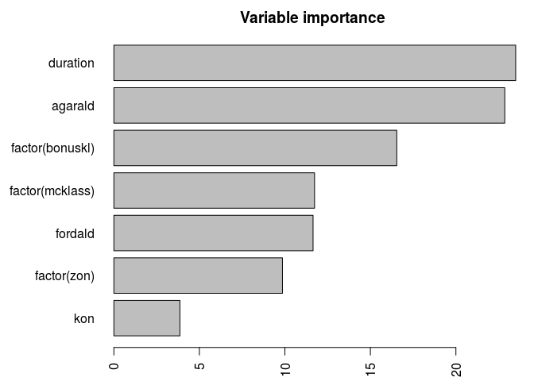

Motorcycle claims - Wasa insurance 1994 to 1998
================
Christian Duffau-Rasmussen
2018-10-01

``` r
library(ggplot2)
library(insuranceData)
library(ROCR)
library(adabag)
data(dataOhlsson)
```

## The data set

The data comes from the former Swedish insurance company Wasa, and
concerns partial casco insurance, for motorcycles. It contains
aggregated data on all insurance policies and claims during
    1994-1998.

``` r
head(dataOhlsson)
```

    ##   agarald kon zon mcklass fordald bonuskl duration antskad skadkost
    ## 1       0   M   1       4      12       1 0.175342       0        0
    ## 2       4   M   3       6       9       1 0.000000       0        0
    ## 3       5   K   3       3      18       1 0.454795       0        0
    ## 4       5   K   4       1      25       1 0.172603       0        0
    ## 5       6   K   2       1      26       1 0.180822       0        0
    ## 6       9   K   3       3       8       1 0.542466       0        0

The variables are:

  - `agarald` The owners age, between 0 and 99, a numeric vector
  - `kon` The owners age, between 0 and 99, a factor with levels K M
  - `zon` Geographic zone numbered from 1 to 7, in a standard
    classification of all Swedish parishes, a numeric vector
  - `mcklass` MC class, a classification by the so called EV ratio,
    defined as (Engine power in kW x 100) / (Vehicle weight in kg + 75),
    rounded to the nearest lower integer. The 75 kg represent the
    average driver weight. The EV ratios are divided into seven classes,
    a numeric vector
  - `fordald` Vehicle age, between 0 and 99, a numeric vector
  - `bonuskl` Bonus class, taking values from 1 to 7. A new driver
    starts with bonus class 1; for each claim-free year the bonus class
    is increased by 1. After the first claim the bonus is decreased by
    2; the driver can not return to class 7 with less than 6 consecutive
    claim free years, a numeric vector
  - `duration` the number of policy years, a numeric vector
  - `antskad` the number of claims, a numeric vector
  - `skadkost` the claim cost, a numeric vector

## Claim classifier

We would like classify which policies would experience claims and which
will not. So first we define the variable “has\_claim”. The models used
are all desribed in detail in Elements of Statistical Learning (Hastie,
Tibshirani, and Friedman 2009).

``` r
dataOhlsson[,"has_claim"] <- factor(dataOhlsson$antskad>0)
```

``` r
proportion <- table(dataOhlsson$has_claim)/nrow(dataOhlsson)
proportion
```

    ## 
    ##      FALSE       TRUE 
    ## 0.98962013 0.01037987

We see that claims are very rare and only 1.04% of all policies have
claims.

``` r
set.seed(123)
test.pct <- 0.5
mask <- runif(nrow(dataOhlsson))>test.pct
train.data <- dataOhlsson[mask, ]
test.data <- dataOhlsson[!mask, ]
```

We reserve approximately 50% of the data set for testing, so the
training set conatians 31937 observations and the remaining 32611
observations are used for testing.

## Logistic regression

Losgistic regression is a classic technique for classification. For
details see (Hastie, Tibshirani, and Friedman 2009, Section 4.4,
pp. 119).

``` r
model <- glm(has_claim ~ agarald + kon + factor(zon) + factor(mcklass) + fordald + factor(bonuskl) + duration, family=binomial(link='logit'), data=train.data)
summary(model)
```

    ## 
    ## Call:
    ## glm(formula = has_claim ~ agarald + kon + factor(zon) + factor(mcklass) + 
    ##     fordald + factor(bonuskl) + duration, family = binomial(link = "logit"), 
    ##     data = train.data)
    ## 
    ## Deviance Residuals: 
    ##     Min       1Q   Median       3Q      Max  
    ## -0.9902  -0.1628  -0.1098  -0.0752   3.6463  
    ## 
    ## Coefficients:
    ##                    Estimate Std. Error z value Pr(>|z|)    
    ## (Intercept)       -2.919344   0.379290  -7.697 1.39e-14 ***
    ## agarald           -0.050581   0.004901 -10.320  < 2e-16 ***
    ## konM               0.760340   0.200386   3.794 0.000148 ***
    ## factor(zon)2      -0.186532   0.157255  -1.186 0.235552    
    ## factor(zon)3      -0.682965   0.173269  -3.942 8.09e-05 ***
    ## factor(zon)4      -0.810529   0.157812  -5.136 2.81e-07 ***
    ## factor(zon)5      -2.479984   0.717794  -3.455 0.000550 ***
    ## factor(zon)6      -1.061032   0.325242  -3.262 0.001105 ** 
    ## factor(zon)7     -13.474532 273.981887  -0.049 0.960776    
    ## factor(mcklass)2   0.925865   0.294280   3.146 0.001654 ** 
    ## factor(mcklass)3   0.269004   0.271799   0.990 0.322313    
    ## factor(mcklass)4   0.130408   0.285613   0.457 0.647966    
    ## factor(mcklass)5   0.430627   0.276353   1.558 0.119174    
    ## factor(mcklass)6   1.001125   0.269106   3.720 0.000199 ***
    ## factor(mcklass)7  -0.820656   0.754332  -1.088 0.276629    
    ## fordald           -0.058503   0.008664  -6.752 1.45e-11 ***
    ## factor(bonuskl)2  -0.070493   0.210600  -0.335 0.737832    
    ## factor(bonuskl)3   0.084260   0.217437   0.388 0.698376    
    ## factor(bonuskl)4   0.264499   0.215001   1.230 0.218613    
    ## factor(bonuskl)5   0.071683   0.244338   0.293 0.769236    
    ## factor(bonuskl)6  -0.123517   0.261214  -0.473 0.636314    
    ## factor(bonuskl)7   0.620139   0.165139   3.755 0.000173 ***
    ## duration           0.128410   0.024854   5.167 2.38e-07 ***
    ## ---
    ## Signif. codes:  0 '***' 0.001 '**' 0.01 '*' 0.05 '.' 0.1 ' ' 1
    ## 
    ## (Dispersion parameter for binomial family taken to be 1)
    ## 
    ##     Null deviance: 3819.6  on 31936  degrees of freedom
    ## Residual deviance: 3453.0  on 31914  degrees of freedom
    ## AIC: 3499
    ## 
    ## Number of Fisher Scoring iterations: 16

``` r
anova(model, test='Chisq')
```

    ## Analysis of Deviance Table
    ## 
    ## Model: binomial, link: logit
    ## 
    ## Response: has_claim
    ## 
    ## Terms added sequentially (first to last)
    ## 
    ## 
    ##                 Df Deviance Resid. Df Resid. Dev  Pr(>Chi)    
    ## NULL                            31936     3819.6              
    ## agarald          1  111.214     31935     3708.4 < 2.2e-16 ***
    ## kon              1   22.522     31934     3685.9 2.078e-06 ***
    ## factor(zon)      6   55.396     31928     3630.5 3.856e-10 ***
    ## factor(mcklass)  6   60.961     31922     3569.5 2.871e-11 ***
    ## fordald          1   60.064     31921     3509.4 9.182e-15 ***
    ## factor(bonuskl)  6   37.190     31915     3472.2 1.617e-06 ***
    ## duration         1   19.276     31914     3453.0 1.131e-05 ***
    ## ---
    ## Signif. codes:  0 '***' 0.001 '**' 0.01 '*' 0.05 '.' 0.1 ' ' 1

``` r
p <- predict(model, newdata=test.data, type="response")
pr <- prediction(p, test.data$has_claim)
performance.logistic_reg <- performance(pr, measure = "tpr", x.measure = "fpr")
auc.logistic_reg <- performance(pr, measure = "auc")@y.values[[1]]
```

## AdaBoost.M1

The AdaBoost.M1 is a learning algorithm which trains a sequence of *M*
descision trees, where the datapoints for training tree number *m* are
weighted according to the predicion accuracy of the previously trained
tree (*m-1*). The observations which are correctly classified by the
prvious tree get a low weight in the next tree, and predictions which
where wrongly classified get a high weight. This way each tree learns
different aspects of the feature space, and perform better in practice.
The algorithm was first formulated in (Freund and Schapire 1997) and is
described in (Hastie, Tibshirani, and Friedman 2009, Section 10.1,
pp. 339).

``` r
model <- adabag::boosting(has_claim ~ agarald + kon + factor(zon) + factor(mcklass) + fordald + factor(bonuskl) + duration, data=train.data, mfinal=100, boos=F, coeflearn='Freund')
par(mar = c(2, 7, 2, 1) + 0.2)
barplot(sort(model$importance), horiz=T, las=2, main="Variable importance")
```

<!-- -->

``` r
p <- adabag::predict.boosting(model, newdata=test.data)$prob[,2]
pr <- prediction(p, test.data$has_claim)
performance.adaboost <- performance(pr, measure = "tpr", x.measure = "fpr")
auc.adaboost <- performance(pr, measure = "auc")@y.values[[1]]
```

## Model performances

``` r
plot(performance.logistic_reg)
lines(performance.adaboost@x.values[[1]], performance.adaboost@y.values[[1]], col=2, new=T)
legend(1,0, c('logistic regression', 'Adaboost.M1'), lwd=1, col=1:2, xjust=1, yjust=0)
```

<!-- -->

``` r
data.frame(auc.logistic_reg, auc.adaboost)
```

    ##   auc.logistic_reg auc.adaboost
    ## 1        0.7699444    0.7413902

## References

<div id="refs" class="references">

<div id="ref-freund1997decision">

Freund, Yoav, and Robert E Schapire. 1997. “A Decision-Theoretic
Generalization of on-Line Learning and an Application to Boosting.”
*Journal of Computer and System Sciences* 55 (1). Elsevier: 119–39.

</div>

<div id="ref-elements_of_statistical_learning">

Hastie, Trevor, Robert Tibshirani, and Jerome Friedman. 2009. *The
Elements of Statistical Learning: Data Mining, Inference and
Prediction*. 2nd ed. Springer.
<http://www-stat.stanford.edu/~tibs/ElemStatLearn/>.

</div>

</div>
